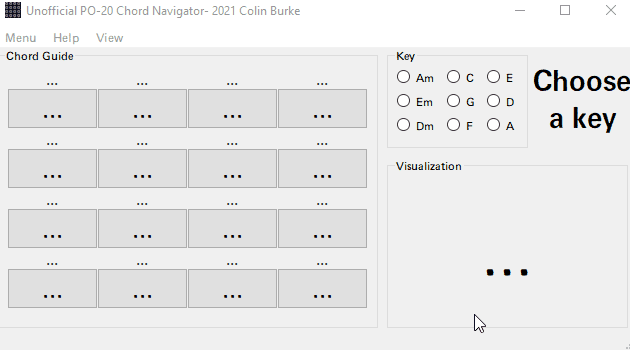

#PO-20 Chord Helper

Use this tool to explore a custom chord network from the [PO-20](https://teenage.engineering/guides/po-20/en), with visual guides.

**PO-20 not required!**

##Quickstart
1. Run pochords.py
2. Choose a key in the **Key** Groupbox
3. Click a visible chord from the **Chord Guide** area you want to inspect in the **Visualization** area. 
4. Repeat this process with different progressions, and play your Piano/Keyboard or your PO-20 on the side to learn how they move and sound!

###View Options
* Use the **View** -> **Toggle Background** to view as if the Pocket Operator is behind
* Use the **View** -> **Show All** option to view all chords at once. 

Live demo coming soon (On a touchscreen with a rig)

You get an animated gif for now. Enjoy!

I don't know why Teenage Engineering chose these chord combinations, but I imagine it would have something to do with a high qty of variety and modulation capability. 
So for this reason alone, I think this chord network is worth exploring more! Especially if you're learning to solo and want a guide. 

## References / Sources for some of the content: 
I used data from these posts on Reddit. 
* [UPDATED: PO-20 chords & keys](reddit.com/r/pocketoperators/comments/6lflrx/heres_a_visual_chord_guide_for_po20_arcade_useful/ ). 
* [Here's a visual chord guide for PO-20 arcade. Useful if you're not big on theory!](reddit.comr/pocketoperators/comments/j7q7fx/updated_po20_chords_keys/ )

##TODO
* Midi out integration

* Eventually create a cheap chord generator that can run on a Pi and use MIDI. 

## Contributions
Please [contribute to me](https://colinburke.com/contribute) if this helped you!